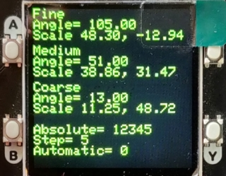
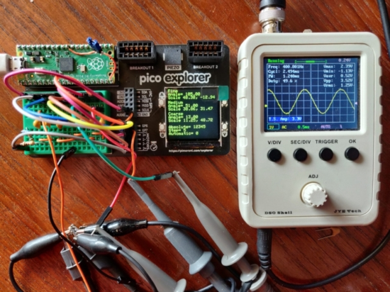
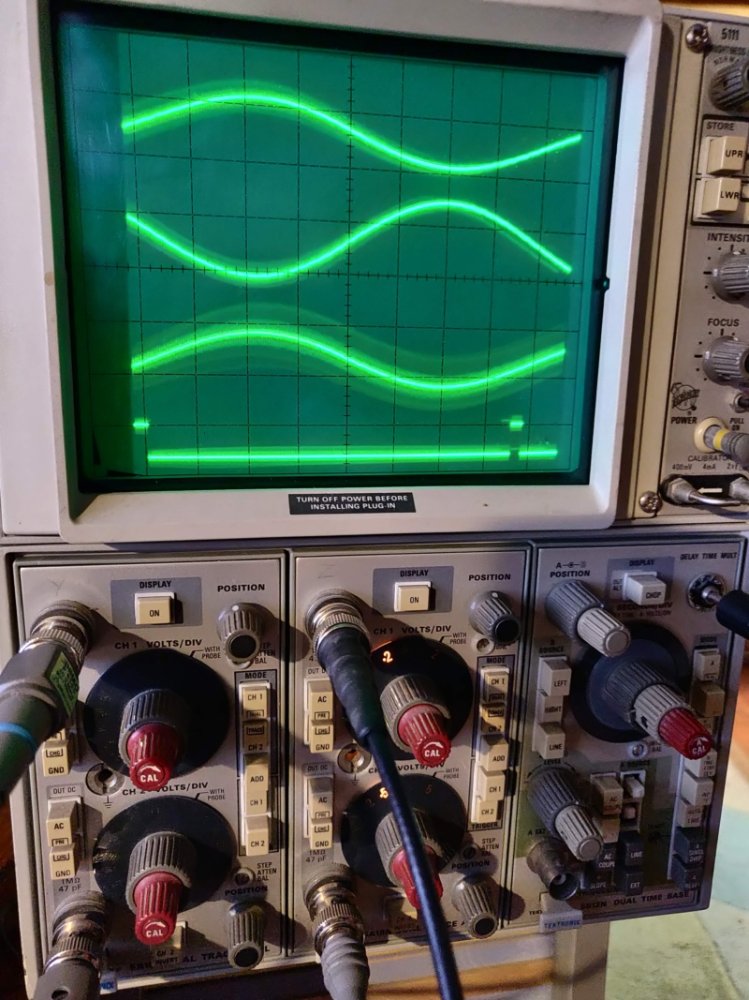
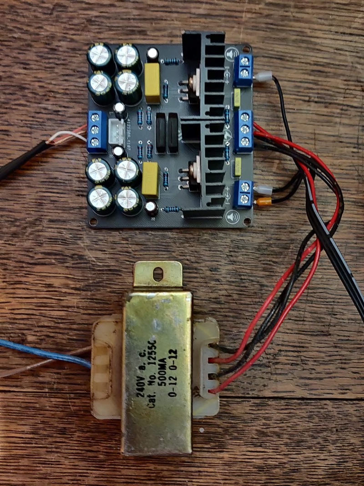
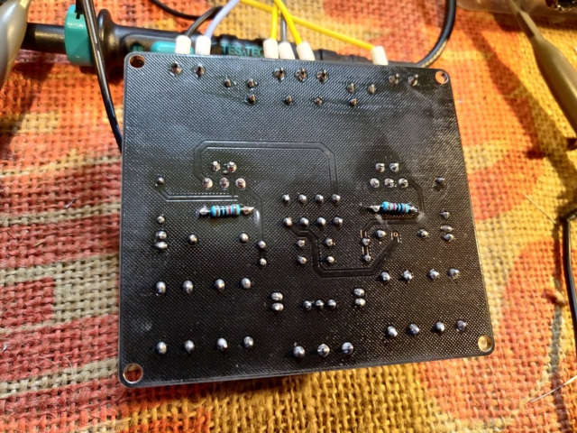
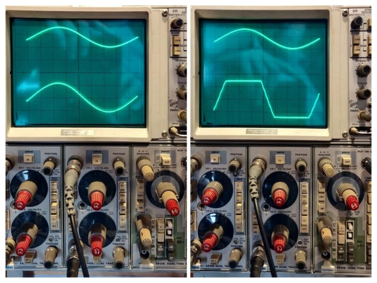

# Aviation_Moving_Map_Display
## PMD (projected map display)
Ferranti: Display, Moving Map 

Ref.No 3892/79850
NSN 6610-99-787-8922


Fitted to Harrier aircraft ZD401:

## Photos

[module images](./images)

[harrier photos](https://www.jetphotos.com/registration/ZD401)

[harrier photos](https://abpic.co.uk/pictures/registration/ZD401)

[Harrier cockpit](https://4.bp.blogspot.com/_fhZZ63PRjhQ/TUsCl6HRGVI/AAAAAAAACPw/2A3Wuko7wsM/s1600/harrier4.jpg)


[UK Grid Reference Finder](https://gridreferencefinder.com/#gr=ST3068378370|51.5_s__c__s_-3|1)

[UK Latitude and Longitude Map](https://www.mapsofworld.com/lat_long/united-kingdom-lat-long.html)

#### More information on similar device:

Information supplied by Erik Baigar, Munich.

[video](http://youtube.com/watch?v=-EQqfxiGgd8)

[website](http://www.baigar.de/TornadoComputerUnit/TimeLine.html)

#### Rochester Aviation Archives

[PMD FILM TRACTION AND LAMP MODULES](https://rochesteravionicarchives.co.uk/collection/navigation-inertial/lamp-unit-and-film-carrier-unit)

[PMD SCREEN MODULE](https://rochesteravionicarchives.co.uk/collection/mission-systems/screen-module)

[SET OF PCBS FROM TORNADO PMD TEST SET](https://rochesteravionicarchives.co.uk/collection/mission-systems/set-of-pcb-from-tornado-pmd)

#### UMMR museum

[Projected map display](http://ummr.altervista.org/avionics.htm#PMDF)

## Exercise software

### Development of map transport exerciser using Raspberrypi Pico 2040 

This is work in progress, initial version drives three pairs of sine/cosine outputs, angle set on serial command line

The serial console is used with a command interpreter to change the settings for test purposes. Console is accesed by USB at 115200 bps with a terminal program or the arduino IDE.

Commads in form "fin 30 [cr]" to set fine output pair to represent angle of 30 degrees, similar commands med, and cou, for medium and coarse settings.

|Command||
|-------|-|
|fin|Fine angle|
|med|Medium angle|
|cou|Coarse angle|
|abs|Absolute index|
|step|index step|
|automatic|Automatic increment|

 * A non-zero value in automatic starts the automatic absolute change cycle
 * Press of button A starts the automatic map movement
 * Press of button B stops the automatic mape movement

#### Status display with buttons



[Arduino sketch](./software/pico_400hz_sine_PWM/pico_400hz_sine_PWM.ino)
<br>
#### Absolute transport position encoding


|Absolute|19|18|17|16|15|14|13|12|11|10|09|08|07|06|05|04|03|02|01|00|
|--------|--|--|--|--|--|--|--|--|--|--|--|--|--|--|--|--|--|--|--|--|
|Fine    |  |  |  |  |  |  |  |  |  |  |  |  |07|06|05|04|03|02|01|00|
|Medium  |  |  |  |  |  |  |  |07|06|05|04|03|02|01|00|  |  |  |  |  |
|Coarse  |  |  |07|06|05|04|03|02|01|00|  |  |  |  |  |  |  |  |  |  |

<br>
##### Absolute to resolver conversion

```
const int ratio1 = 30;
const int ratio2 = ratio1*30;

void abs2res(long absolute, float *fine, float *medium, float *coarse)
{
        *coarse = (absolute / ratio2) - offset_coarse;
        *medium = (absolute / ratio1) % 360;
        *fine  =   absolute           % 360;

}
```

##### Resolver to absolute conversion

```
const int ratio1 = 30;
const int ratio2 = ratio1*30;

unsigned long res2abs(int fine, int medium, int coarse)
{
    return (fine % ratio1)     
    + (ratio1 * (medium % ratio1))   
    + (ratio2 * (coarse % ratio2));
}
```

#### Wiring

A 400Hz 24 VAC reference signal from the module power supply is attenuated and clipped before being fed into an input of the pico, this is used to synchronise the generated waveforms to the reference . The input is fed through 10K resistor with a diode to ground in parallel with a 1K restor.

The PWM outputs are fed through a RC filter to form the analogue resolver signals. each channel is red through a 1K resistor and has a 100nF capacator to ground.

Each pair of resolver signals is fed to a dual LM1875 amlifier to drive the module inputs. The amplifier gain is adjusted to give the required output level by tweaking its feedback resitor. (10K in parallel with existing 20k resistor)

A reference 400Hz is availabe on a seventh channel (unused)

A Reference pulse output is available to trigger the oscilloscope.











[representive LM1875 schematic](https://www.circuitbasics.com/audio-amplifiers/)

[Video: Resolver 400Hz sine / cosine from PWM generator](https://youtube.com/shorts/cyT_KI8JY5w)

[Video: initial pico map move](https://youtube.com/shorts/sYDpD-SnMvI)

## Connections

#### 66 pin 18B35P PMD connector

[Amphenol Connector 201-220-jt_series.pdf](./documents/201-220-jt_series.pdf) 


 * Note: Connections marked n/c have no wires connected to plug
 * Note: pins without comment have unknown purpose
 * Note: Alt pins are equivalent functions on RPMD module
 * Additional information supplied by Erik Baigar see: [http://www.baigar.de/TornadoComputerUnit/TimeLine.html#20130205](http://www.baigar.de/TornadoComputerUnit/TimeLine.html#20130205)

<br>

|Pin #|Alt #|Function  |Note          |
|-----|-----|----------|------------  |
| ?|  1  | -ve         |DC Return     |
|02|  2  | Neutral     |400Hz Return  |
|03|  3  | 115VAC      |400Hz Power   |
|04||||
|05||||
|06||n/c|
|07||n/c|
|08||n/c|
|09|  9  | 0V          |Chassis       |
|10|10||input DAY/NIGHT control |
|11||||
|12||n/c||
|13||n/c||
|14||n/c||
|15||||
|16|     |728k to -ve  |+ve relay? ip|
|17||||
|18||||
|19||n/c||
|20||n/c||
|21||||
|22|     | 11R to 32 |V prop to I lamp|
|23||||
|24||||
|25||||
|26|  4  | +28V DC     |DC Power      |
|27| 17  | +28V DC     |DC Power      |
|28||||
|29||||
|30|30||input to RPMD inhibiting map drive|
|31||||
|32| 32  | -ve         |DC Return     |
|33||||

<br>

|Pin #|Alt #|Function  |Note          |
|-----|-----|----------|------------  |
|34| 34 |12 v op      |Scale switch-a|
|35| 35 |12 v op      |Scale switch-b|
|36| 36 |12 v op   |Function switch-a|
|37| 37 |12 v op   |Function switch-b|
|38| 38 |12 v op   |Function switch-c|
|39||n/c||
|40|40|235R to 41||STB Lamp when positive|
|41|41|235R to 40||NTH UP lamp when positive|
|42| 42  |+28V DC      |Mains-on ip   |
|43| 43  | a           |Heading-a     |
|44| 44  | b           |Heading-b     |
|45| 45  | common      |Heading-com   |
|46||||
|47||||
|48| 48  | 26V 400Hz   |Reference     |
|49| 49  | 0V 400Hz    |Ref.return    |
|50||||
|51| 51  | a           |Fine-a        |
|52| 52  | b           |Fine-b        |
|53| 53  | common      |Fine-com      |
|54| 54  | a           |N/S-a         |
|55| 55  | b           |N/S-b         |
|56| 56  | common      |N/S-com       |
|57||n/c||
|58||n/c||
|59| 59  | a           |Medium-a      |
|60| 60  | b           |Medium-b      |
|61| 61  | common      |Medium-com    |
|62||n/c||
|63||n/c||
|64| 64  | X3 yellow   |Coarse-a      |
|65| 65  | X3 red      |Coarse-b      |
|66| 66  | X3 black    |Coarse-com    |

pin#22 has 0 to -10v PWM like signal which is proportional to lamp brightness

## Circuit boards

[boards photo](https://cdn.rochesteravionicarchives.co.uk/img/catalog/C1774_%28pcbs_small%29_.jpg?w=1500&fit=max)

<br>

|No|Name|Position|
|--|----|--------|
|5|AMPLIFIER, ERROR (Y-Θ)|Bottom|
|6|DRIVER, LAMP CHANGER|Bottom|
|7|AMPLIFIER, ERROR X|Top|
|8|AMPLIFIER, ELECTRONIC CONTROL|Top|
|9|AMPLIFIER, EC (OUTPUT)|Side|

* Note: 10, 11, 12 not fitted

<br>

|Pin #|Board 5|AMPLIFIER, ERROR (Y-Θ)|
|-----|-------|----------------------|
| 1, 2| +5 V  ||
| 3, 4|  0 V  ||
|31,32|Gnd?   ||
|37,38|-16 V  ||
|51,52|+16 V  ||
|57   | 26 VAC|400 Hz Reference      |
|  60 |  0 VAC|Reference return      |

## Front panel switches

<br>

### Scale switch

|Fn. |#34|#35|
|----|---|---|
|56-1| H | L |
|28-1/2| L | H |
|14-1/4| H | H |

<br>

### Function switch

|Fn.|#36|#37|#38|
|---|---|---|---|
|off| L | L | L |
| N | H | L | L |
|TRK| L | L | L |
|DEC| H | H | L |
| e | L | H | H |
| f | L | L | H |

