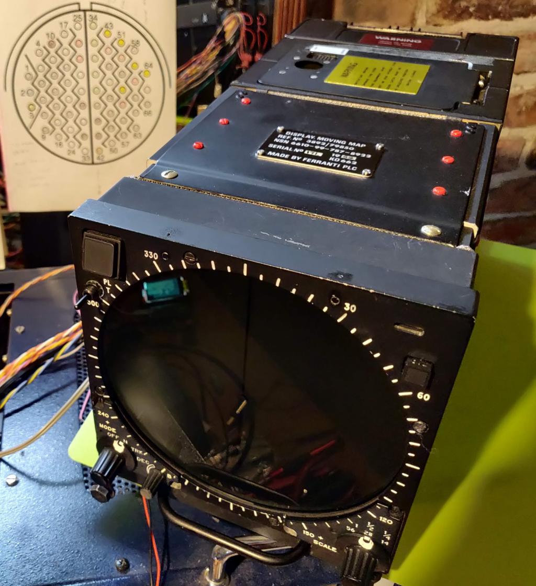
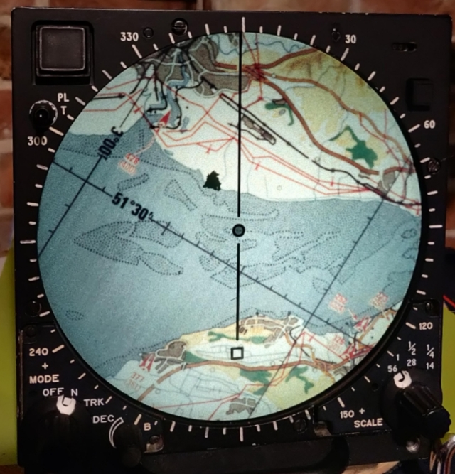
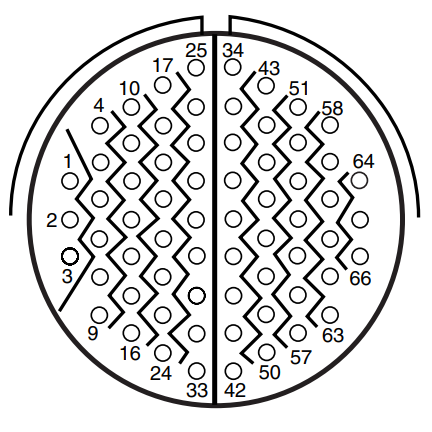

# Aviation_Moving_Map_Display
## PMD (projected map display)
Ferranti: Display, Moving Map 

Ref.No 3892/79850
NSN 6610-99-787-8922

Fitted to Harrier aircraft ZD401:

## Photos

[module images](./images)

[harrier photos](https://www.jetphotos.com/registration/ZD401)

[harrier photos](https://abpic.co.uk/pictures/registration/ZD401)

[Harrier cockpit](https://4.bp.blogspot.com/_fhZZ63PRjhQ/TUsCl6HRGVI/AAAAAAAACPw/2A3Wuko7wsM/s1600/harrier4.jpg)

[UK Grid Reference Finder](https://gridreferencefinder.com/#gr=ST3068378370|51.5_s__c__s_-3|1)

[UK Latitude and Longitude Map](https://www.mapsofworld.com/lat_long/united-kingdom-lat-long.html)

#### More information on similar device:

Information supplied by Erik Baigar, Munich.

[video](http://youtube.com/watch?v=-EQqfxiGgd8)

[website](http://www.baigar.de/TornadoComputerUnit/TimeLine.html)

#### Rochester Aviation Archives

[PMD FILM TRACTION AND LAMP MODULES](https://rochesteravionicarchives.co.uk/collection/navigation-inertial/lamp-unit-and-film-carrier-unit)

[PMD SCREEN MODULE](https://rochesteravionicarchives.co.uk/collection/mission-systems/screen-module)

[SET OF PCBS FROM TORNADO PMD TEST SET](https://rochesteravionicarchives.co.uk/collection/mission-systems/set-of-pcb-from-tornado-pmd)

#### UMMR museum

[Projected map display](http://ummr.altervista.org/avionics.htm#PMDF)

## Connections

#### 66 pin 18B35P PMD connector

[Amphenol Connector 201-220-jt_series.pdf](./documents/201-220-jt_series.pdf) 

 * Note: Connections marked n/c have no wires connected to plug
 * Note: pins without comment have unknown purpose
 * Note: Alt pins are equivalent functions on RPMD module
 * Additional information supplied by Erik Baigar see: [http://www.baigar.de/TornadoComputerUnit/TimeLine.html#20130205](http://www.baigar.de/TornadoComputerUnit/TimeLine.html#20130205)

 

|Pin #|Alt #|Function  |Note          |
|-----|-----|----------|------------  |
| ?|  1  | -ve         |DC Return     |
|02|  2  | Neutral     |400Hz Return  |
|03|  3  | 115VAC      |400Hz Power   |
|04||||
|05||||
|06||n/c|
|07||n/c|
|08||n/c|
|09|  9  | 0V          |Chassis       |
|10|10||input DAY/NIGHT control |
|11||||
|12||n/c||
|13||n/c||
|14||n/c||
|15||||
|16|     |728k to -ve  |+ve relay? ip|
|17||||
|18||||
|19||n/c||
|20||n/c||
|21||||
|22|     | 11R to 32 |V prop to I lamp|
|23||||
|24||||
|25||||
|26|  4  | +28V DC     |DC Power      |
|27| 17  | +28V DC     |DC Power      |
|28||||
|29||||
|30|30||input to RPMD inhibiting map drive|
|31||||
|32| 32  | -ve         |DC Return     |
|33||||

 

|Pin #|Alt #|Function  |Note          |
|-----|-----|----------|------------  |
|34| 34 |12 v op      |Scale switch-a|
|35| 35 |12 v op      |Scale switch-b|
|36| 36 |12 v op   |Function switch-a|
|37| 37 |12 v op   |Function switch-b|
|38| 38 |12 v op   |Function switch-c|
|39||n/c||
|40|40|235R to 41||STB Lamp when positive|
|41|41|235R to 40||NTH UP lamp when positive|
|42| 42  |+28V DC      |Mains-on ip   |
|43| 43  | a           |Heading-a     |
|44| 44  | b           |Heading-b     |
|45| 45  | common      |Heading-com   |
|46||||
|47||||
|48| 48  | 26V 400Hz   |Reference     |
|49| 49  | 0V 400Hz    |Ref.return    |
|50||||
|51| 51  | a           |Fine-a        |
|52| 52  | b           |Fine-b        |
|53| 53  | common      |Fine-com      |
|54| 54  | a           |N/S-a         |
|55| 55  | b           |N/S-b         |
|56| 56  | common      |N/S-com       |
|57||n/c||
|58||n/c||
|59| 59  | a           |Medium-a      |
|60| 60  | b           |Medium-b      |
|61| 61  | common      |Medium-com    |
|62||n/c||
|63||n/c||
|64| 64  | X3 yellow   |Coarse-a      |
|65| 65  | X3 red      |Coarse-b      |
|66| 66  | X3 black    |Coarse-com    |

pin#22 has 0 to -10v PWM like signal which is proportional to lamp brightness

## Circuit boards

[boards photo](https://cdn.rochesteravionicarchives.co.uk/img/catalog/C1774_%28pcbs_small%29_.jpg?w=1500&fit=max)

 

|No|Name|Position|
|--|----|--------|
|5|AMPLIFIER, ERROR (Y-Θ)|Bottom|
|6|DRIVER, LAMP CHANGER|Bottom|
|7|AMPLIFIER, ERROR X|Top|
|8|AMPLIFIER, ELECTRONIC CONTROL|Top|
|9|AMPLIFIER, EC (OUTPUT)|Side|

* Note: 10, 11, 12 not fitted

 

|Pin #|Board 5|AMPLIFIER, ERROR (Y-Θ)|
|-----|-------|----------------------|
| 1, 2| +5 V  ||
| 3, 4|  0 V  ||
|31,32|Gnd?   ||
|37,38|-16 V  ||
|51,52|+16 V  ||
|57   | 26 VAC|400 Hz Reference      |
|  60 |  0 VAC|Reference return      |

## Front panel switches

 

### Scale switch

|Fn. |#34|#35|
|----|---|---|
|56-1| H | L |
|28-1/2| L | H |
|14-1/4| H | H |

 

### Function switch

|Fn.|#36|#37|#38|
|---|---|---|---|
|off| L | L | L |
| N | H | L | L |
|TRK| L | L | L |
|DEC| H | H | L |
| e | L | H | H |
| f | L | L | H |

