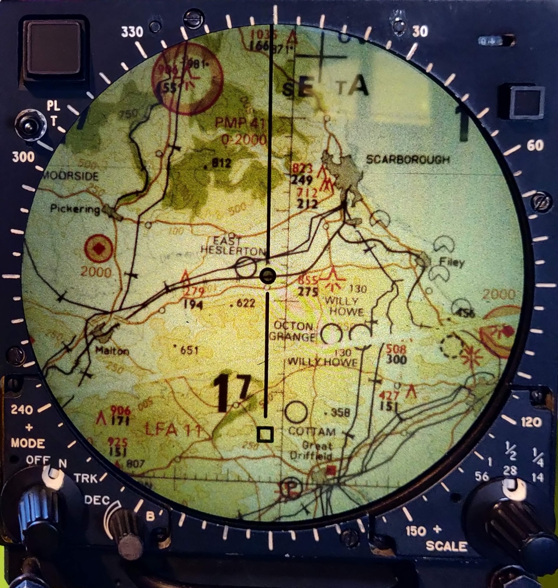
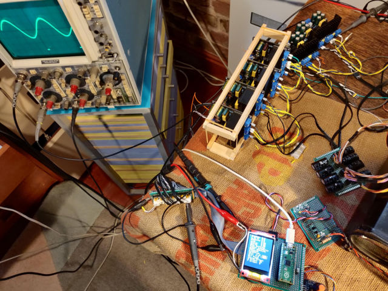
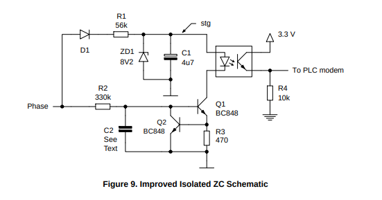
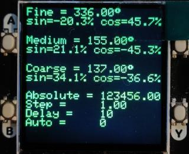
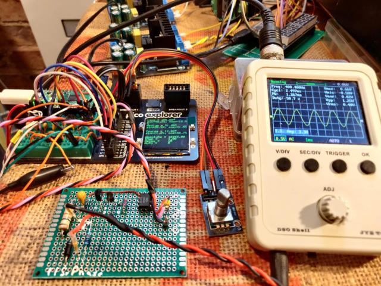

# Aviation_Moving_Map_Display
## PMD (projected map display)
Ferranti: Display, Moving Map 

Ref.No 3892/79850
NSN 6610-99-787-8922

Fitted to Harrier aircraft ZD401:

## Demo Video

[Map movement](https://youtube.com/shorts/AGmHbEKlPaY)

## Photos

Photos of this module [images](./images/README.md)

harrier photos [jetphotos](https://www.jetphotos.com/registration/ZD401) [abpic](https://abpic.co.uk/pictures/registration/ZD401)

Inside the harrier [cockpit](https://4.bp.blogspot.com/_fhZZ63PRjhQ/TUsCl6HRGVI/AAAAAAAACPw/2A3Wuko7wsM/s1600/harrier4.jpg)




[UK Grid Reference Finder](https://gridreferencefinder.com/#gr=ST3068378370|51.5_s__c__s_-3|1)

[UK Latitude and Longitude Map](https://www.mapsofworld.com/lat_long/united-kingdom-lat-long.html)

[Military chasrt symbols Gen 2.3](https://www.aidu.mod.uk/aip/pdf/gen/GEN-2-3.pdf)

[Latitude & Longitude definitions](https://maptools.com/tutorials/lat_lon/definitions)

[Lat / Long distance calculator](https://www.nhc.noaa.gov/gccalc.shtml)

#### More information on similar device:

Information supplied by Erik Baigar, Munich.

[video](http://youtube.com/watch?v=-EQqfxiGgd8)

[website](http://www.baigar.de/TornadoComputerUnit/TimeLine.html)

#### Rochester Aviation Archives

[PMD FILM TRACTION AND LAMP MODULES](https://rochesteravionicarchives.co.uk/collection/navigation-inertial/lamp-unit-and-film-carrier-unit)

[PMD SCREEN MODULE](https://rochesteravionicarchives.co.uk/collection/mission-systems/screen-module)

[SET OF PCBS FROM TORNADO PMD TEST SET](https://rochesteravionicarchives.co.uk/collection/mission-systems/set-of-pcb-from-tornado-pmd)

#### UMMR museum

[Projected map display](http://ummr.altervista.org/avionics.htm#PMDF)

## Exercise software



[software versions](./software/README.md)

### Development of map transport exerciser using Raspberrypi Pico 2040 

The software simulates three 400 Hz resolver tranmitters and provides a reference sinewave.
Present version drives three pairs of sine/cosine outputs, and an additional pair of sinewave outputs 180 degree apart as reference.
Resolver simulation is controlled by serial commands, push buttons, and a rotary encoder.
Console is accesed by USB at 115200 bps with a terminal program or the arduino IDE.

### Doxygen project

There is a Doxygen project file to create additional documentation of the software and libraries used. this readme and the module pictures get included. The doygen html needs to be created by running doxywizard. the html is not included in this repositary.

[Doxyfile](./Doxyfile)

### PWM

#### RC Filter

PWM frequency is set to 100kHz by dividing the pico clock (133 Mhz) by 1330

The output is then filtered to remove the individuel pulses leaving the mean voltage proportional to the PWM duty cycle.

[calculation](http://sim.okawa-denshi.jp/en/Fkeisan.htm) R=1k, C=100n,  Cut-off frequency: fc = 1591.5Hz 


#### 400 Hz generation

The PWM output duty cycle is modified regularly triggered by a timer set to a rate equal to the desired output frequency (400Hz) divided by the number of samples in a single cycle (36 ), or 69.5 uS

Unfortunateley the timer rate has to be an integer when using the arduino and so 69 or 70 have to be used. other possabilities are shown below, note 20 samples give an accurate 400Hz at the expense of a slightly steppy resultaing waveform:
```
36 table entries,  === 36 samples per cycle
1E6Hz  / 400Hz / (36) = 69.444 uS timer interval
69 = 402.576 Hz
70 = 396.825 Hz

40 table entries,  === 40 samples per cycle
1E6Hz  / 400Hz / (40) = . uS timer interval
62 = 403.2 Hz
64 = 396.8 Hz

20 table entries,  === 20 samples per cycle
1E6Hz  / 400Hz / (20) = . uS timer interval
125 = 400.0 Hz
```
The choice of frequency and sample count is made by constants in the program code defining the sine table generation and timer duration.

The waveform amplitude is obtained by reading a sine lookup table generated at program start, modified amplitudes for the resolver angles are made using the library sin and cos functions, speed is not an issue here as these calculations are done in the main program loop - not in the timer function.

#### Synchronisation

The 400 Hz waveform generators can be synchronised to an external 400 Hz signal, the signal is applied to a zero crossing detector, the output of which rises to 3v3 whenever the input voltage rizes positive above 0v. The pico interrupt input needs to be set to trigger on the rising edge.

Photo shows 3.3 V output rising edge coincident with zero crossing of input 115 V~ 400 Hz, trailing edge is not well defined and unused.


Video shows input voltage being raised from 0 to 115 VAC 400Hz

[Youtube ZCD](https://youtube.com/shorts/z_t_Pi9b5Q8?feature=shareL)

####   Improved Isolated ZC Schematic



##### Revised parts list:

|Part|Value |
|--|--|
|Q1|BC639|
|Q2|BC639|
|OC1|4N33|
|R1|22k|
|C1|2.2F|
|ZD1|9V1|
|R2|100k|
|R3|470R|
|R4|2.2k|


[AND9282 - Mains Synchronization for PLC Modems](https://www.mikrocontroller.net/attachment/346746/AND9282-D_AC_Zero_Crossing.pdf)

#### LCD / Encoder menu system


|Item|
|---------------|
|Heading|
|N to S |
|Absolute|
|Fine|
|Medium|
|Coarse|
|Show Settings|
|Toggle Automatic|
|Reset Absolute|
|Stepsize|
|AutoDelay|
|Vout|
|Vref|
|Ref Phase|
|Coarse Offset|
|M Offset|
|F Offset|


#### Serial commands (not implemented in present version)

Commads in form "fin 30 [cr]" to set fine output pair to represent angle of 30 degrees, similar commands med, and cou, for medium and coarse settings.

|Command||
|-------|-|
|fin|Fine angle|
|med|Medium angle|
|coa|Coarse angle|
|abs|Absolute index|
|rep|report current settings|
|step|index step|
|auto|enable automatic increment|
|del|delay mS between increments|
|amp|Output amplitude divider|

 * rotation of the encoder adjusts the absolute value by plus or minus step
 * A non-zero value in automatic starts the automatic absolute change cycle
 * Press of button A starts the automatic map movement
 * Press of button B stops the automatic mape movement
 * Press of Encoder button resets absolute position value
 * disabled: (When changing from auto to manual the encoder value is updated to allow fine control.)

#### Status display with buttons



[Arduino sketch](./software/pico_400hz_sine_PWM/pico_400hz_sine_PWM.ino)

### Pico2040 pin designations

|GP Pin|Function|
|------|--------|
|16|TFT DC|
|17|TFT CS|
|18|TFT SCLK|
|19|TFT MOSI|
|22|ENCODER IN1|
|21|ENCODER IN2|
|20|ENCODER SW|
| 0|PWM 0 |
| 1|PWM 1 |
| 2|PWM 2|
| 3|PWM 3|
| 4|PWM 4|
| 5|PWM 5|
| 6|PWM 6|
| 7|PWM 7|
| 8|PWM 8|
| 9|PWM 9|
|10|PWM 10|
|11|PWM 11|
|14|Sync OP|
|15|Trig IP|

### Amplifier interconnections

|Channel|Res|PWM|GPIO|Amp|R-L|Pin|
|-------|---|---|----|---|---|---|
|Fine   |sin| 0A|  0 | 1 | R |51 |
|Fine   |cos| 0B|  1 | 1 | L |52 |
|Fine   |com| - |  - | - | C |53 |
|Medium |sin| 1A|  2 | 2 | R |59 |
|Medium |cos| 1B|  3 | 2 | L |60 |
|Medium |com| - |  - | - | C |61 |
|Coarse |sin| 2A|  4 | 3 | R |64 |
|Coarse |cos| 2B|  5 | 3 | L |65 |
|Coarse |com| - |  - | - | C |66 |
|Ref    | - | 3A|  6 | 4 | R |48?|
|Ref    | + | 3B|  7 | 4 | L |49?|
|Ref    |com| - |  - | - | C |47 |
|Heading|sin| 4A|  8 | 5 | R |43|
|Heading|cos| 4B|  9 | 5 | L |44|
|Heading|com| - |  - | - | C |45|
|N to S |sin| 5A| 10 | 6 | R |54|
|N to S |cos| 5B| 11 | 6 | L |55|
|N to S |com| - |  - | - | C |56|


#### Initial conditions

 * After reset the module starts at absolute position of 0
 * sin outputs are zero amplitude, cos outputs are +ve maximum
 * -ve ref output is positive going at start of trigger output
 * +ve ref output is negative going at start of trigger output  
 * sync output pulse positive edge is coincident with star of positive going cos 0 output
 * sync pulse input triggers start of positive going +ve ref output, cos 0 outputs
 * as angles increase from 0 sin outputs start to increase in positive direction
 * as angles increade positice cos output decreases


<br>

#### Absolute transport position encoding

Approximate representation showing supposed overlap of resolver rotations.

|Absolute|19|18|17|16|15|14|13|12|11|10|09|08|07|06|05|04|03|02|01|00|
|--------|--|--|--|--|--|--|--|--|--|--|--|--|--|--|--|--|--|--|--|--|
|Fine    |  |  |  |  |  |  |  |  |  |  |  |  |07|06|05|04|03|02|01|00|
|Medium  |  |  |  |  |  |  |  |07|06|05|04|03|02|01|00|  |  |  |  |  |
|Coarse  |  |  |07|06|05|04|03|02|01|00|  |  |  |  |  |  |  |  |  |  |

<br>

##### Absolute to resolver conversion

```
const float ratio1 = 31.9;
const float ratio2 = ratio1*32.1;

void abs2res(long absolute, float *fine, float *medium, float *coarse)
{
        *coarse = (absolute / ratio2) - offset_coarse;
        *medium = fmod((absolute / ratio1), 360);
        *fine   = fmod( absolute          , 360);

}
```

#### Wiring

A 400Hz 24 VAC reference signal from the module power supply is attenuated and clipped before being fed into an input of the pico, this is used to synchronise the generated waveforms to the reference . The input is fed through 10K resistor with a diode to ground in parallel with a 1K restor.

The PWM outputs are fed through a RC filter to form the analogue resolver signals. each channel is red through a 1K resistor and has a 100nF capacator to ground.

The signal output level is chosen to avaoid output clipping in the audio amplifiers.

Each pair of resolver signals is fed to a dual LM1875 amlifier to drive the module inputs.

A reference 400Hz is availabe on a seventh channel (unused)

A Reference pulse output is available to trigger the oscilloscope.




[representive LM1875 schematic](https://www.circuitbasics.com/audio-amplifiers/)

[Video: Resolver 400Hz sine / cosine from PWM generator](https://youtube.com/shorts/cyT_KI8JY5w)

[Video: initial pico map move](https://youtube.com/shorts/sYDpD-SnMvI)

[Video resolver spinning xy display](https://youtube.com/shorts/flxdNe_Nj5M)

## Connections

#### 66 pin 18B35P PMD connector

[Amphenol Connector 201-220-jt_series.pdf](./documents/201-220-jt_series.pdf) 


 * Note: Connections marked n/c have no wires connected to plug
 * Note: pins without comment have unknown purpose
 * Note: Alt pins are equivalent functions on RPMD module
 * Additional information supplied by Erik Baigar see: [http://www.baigar.de/TornadoComputerUnit/TimeLine.html#20130205](http://www.baigar.de/TornadoComputerUnit/TimeLine.html#20130205)

##### Power requirements

 * 115 V 400Hz 0.5 to 1.0 amp (depends on lamp brightness)
 * 28 VDC <100 mA
 * 12-0-12 V 400 Hz resolver reference signal
 * 11 V 400 Hz resolver signals, two per channel, 5 channels
 * 28 VDC relay inputs ( pin 42 needed to power on unit )

 * Pin 16 when fed with 28 volts sometimes causes high current draw - lamp change motor.
 * This seems to now be broken as some smoke came out from the rear - ok without pin 16 active.
 * complete unit can just be powered from my static inverter,  about 8.5 amp DC input when lamp lit

<br>

|Pin #|Alt #|Function  |Note          |
|-----|-----|----------|------------  |
| ?|  1  | -ve         |DC Return     |
|02|  2  | Neutral     |400Hz Return  |
|03|  3  | 115VAC      |400Hz Power   |
|04| | | |
|05| | | |
|06| |n/c| |
|07| |n/c| |
|08| |n/c| |
|09|  9  | 0V          |Chassis       |
|10|10| |input DAY/NIGHT control |
|11| | | |
|12| |n/c| |
|13| |n/c| |
|14| |n/c| |
|15| | | |
|16|     |728k to -ve  |+ve relay? ip|
|17| | | |
|18| | | |
|19| |n/c| |
|20| |n/c| |
|21| | | |
|22|     | 11R to 32 |V prop to I lamp|
|23| | | |
|24| | | |
|25| | | |
|26|  4  | +28V DC     |DC Power      |
|27| 17  | +28V DC     |DC Power      |
|28| | | |
|29| | | |
|30|30| |input to RPMD inhibiting map drive|
|31| | | |
|32| 32  | -ve         |DC Return     |
|33| | | |

<br>


|Pin #|Alt #|Function     |Note             |
|-----|-----|-------------|-----------------|
| 34  | 34  |12 v op      |Scale switch-a   |
| 35  | 35  |12 v op      |Scale switch-b   |
| 36  | 36  |12 v op      |Function switch-a|
| 37  | 37  |12 v op      |Function switch-b|
| 38  | 38  |12 v op      |Function switch-c|
| 39  |     |n/c          |                 |
| 40  | 40  |235R to 41 |STB Lamp when positive|
| 41  | 41  |235R to 40 |NTH UP lamp when positive|
| 42  | 42  |+28V DC      |Mains-on ip   |
| 43  | 43  | a           |Heading-a     |
| 44  | 44  | b           |Heading-b     |
| 45  | 45  | common      |Heading-com   |
| 46  |     |             |              |
| 47  | 47  |  0V         |Reference common|
| 48  | 48  | +12V 400Hz  |Reference       |
| 49  | 49  | -12V 400Hz  |Reference       |
| 50  |     |             |              |
| 51  | 51  | a           |Fine-a        |
| 52  | 52  | b           |Fine-b        |
| 53  | 53  | common      |Fine-com      |
| 54  | 54  | a           |N/S-a         |
| 55  | 55  | b           |N/S-b         |
| 56  | 56  | common      |N/S-com       |
| 57  |     | n/c         |              |
| 58  |     | n/c         |              |
| 59  | 59  | a           |Medium-a      |
| 60  | 60  | b           |Medium-b      |
| 61  | 61  | common      |Medium-com    |
| 62  |     | n/c         |              |
| 63  |     | n/c         |              |
| 64  | 64  | X3 yellow   |Coarse-a      |
| 65  | 65  | X3 red      |Coarse-b      |
| 66  | 66  | X3 black    |Coarse-com    |


pin#22 has 0 to -10v PWM like signal which is proportional to lamp brightness

## Circuit boards

<table><tr>
<tr>

<td valign="bottom">
<br>
No5_AMPLIFIER_ERROR_YT.jpg
</td>

<td valign="bottom">
<br>
No6_DRIVER_LAMP_CHANGER.jpg
</td>

<td valign="bottom">
<br>
No7_AMPLIFIER_ERROR_X.jpg
</td>

<td valign="bottom">
<br>
No8_AMP._ELECTRONIC_CONTROL.jpg
</td>

<td valign="bottom">
<br>
No9_AMPLIFIER_EC_OUTPUT.jpg
</td>

</tr>
<tr>

<td valign="bottom">
<br>
Screen Realy_Board.jpg
</td>

<td valign="bottom">
<br>
Screen Rectifier_Board.jpg
</td>

</tr>
</table>


[boards photo](https://cdn.rochesteravionicarchives.co.uk/img/catalog/C1774_%28pcbs_small%29_.jpg?w=1500&fit=max)


### Screen module circuit boards

* Note: Boards 10, 11, 12 not fitted

|No|Name|Position|
|--|----|--------|
|5|AMPLIFIER, ERROR (Y-Θ)|Bottom|
|6|DRIVER, LAMP CHANGER|Bottom|
|7|AMPLIFIER, ERROR X|Top|
|8|AMPLIFIER, ELECTRONIC CONTROL|Top|
|9|AMPLIFIER, EC (OUTPUT)|Side|
|n/a|Rectifier Board|Side|
|n/a|Relay Board|Side|


### Board connector layout looking into PCB connector

|  |  |  |  |  |  |  |  |  |  |  |  |  |  |  |  |  |  |  |  |  |  |  |  |  |  |  |  |  |  |  |  |  |  |  |  |  |  |  |  |  |  |  |  |
|--|--|--|--|--|--|--|--|--|--|--|--|--|--|--|--|--|--|--|--|--|--|--|--|--|--|--|--|--|--|--|--|--|--|--|--|--|--|--|--|--|--|--|--|
| 2| 4|  | 6| 8|  |10|12|  |14|16|  |18|20|  |22|24|  |26|28|  |30|32|  |34|36|  |38|40|  |42|44|  |46|48|  |50|52|  |54|56|  |58|60|
| 1| 3|  | 5| 7|  | 9|11|  |13|15|  |17|19|  |21|23|  |25|27|  |29|31|  |33|35|  |37|39|  |41|43|  |45|47|  |49|51|  |53|55|  |57|59|
|  |  |  |  |  |  |  |  |  |  |  |  |  |  |  |  |  |  |  |  |  |  |  |  |  |  |  |  |  |  |  |  |  |  |  |  |  |  |  |  |  |  |  |  |

<br>

### Board pin functions

|Pin #|Board 5|AMPLIFIER, ERROR (Y-Θ)|
|-----|-------|----------------------|
| 1, 2| +5 V  ||
| 3, 4|  0 V  ||
|31,32|Gnd?   ||
|37,38|-16 V  ||
|51,52|+16 V  ||
|57   | 12 VAC|400 Hz +Reference ext_p48 |
|  60 | 12 VAC|400 Hz -Reference ext_p49 |
|   ? |  0 VAC|400 Hz Ref Common ct&gnd  |  

## Front panel switches

<br>

### Scale switch

|Fn. |#34|#35|
|----|---|---|
|56-1| H | L |
|28-1/2| L | H |
|14-1/4| H | H |

<br>

### Function switch

|Fn.|#36|#37|#38|
|---|---|---|---|
|off| L | L | L |
| N | H | L | L |
|TRK| L | L | L |
|DEC| H | H | L |
| e | L | H | H |
| f | L | L | H |

