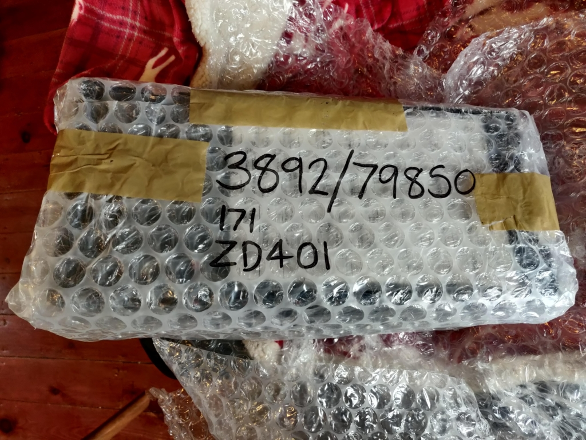
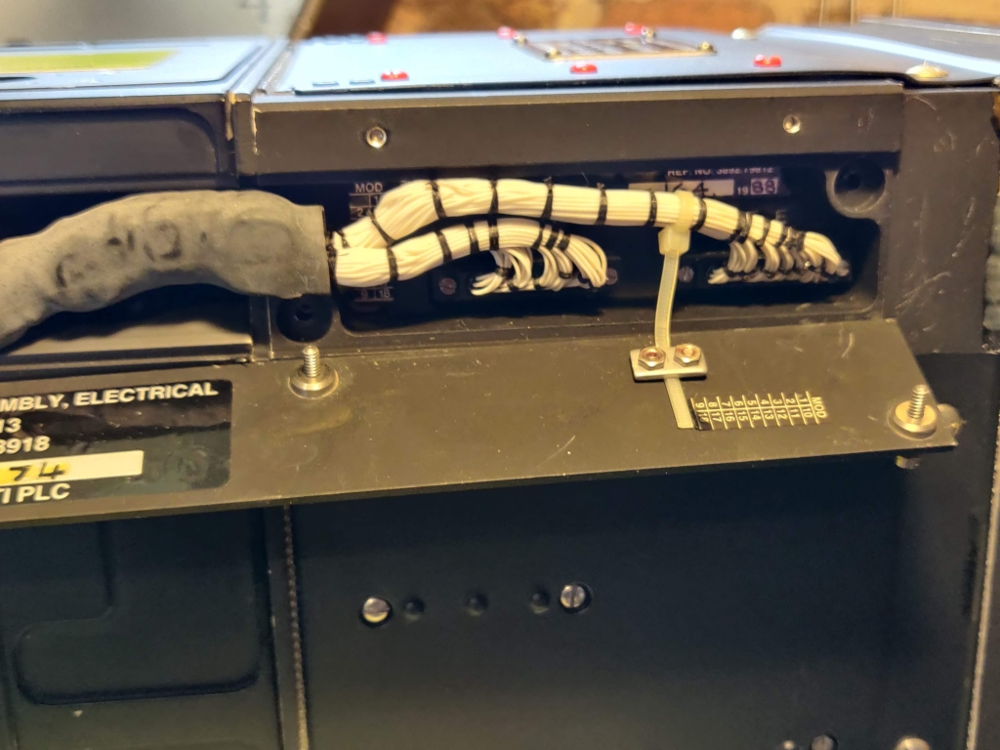
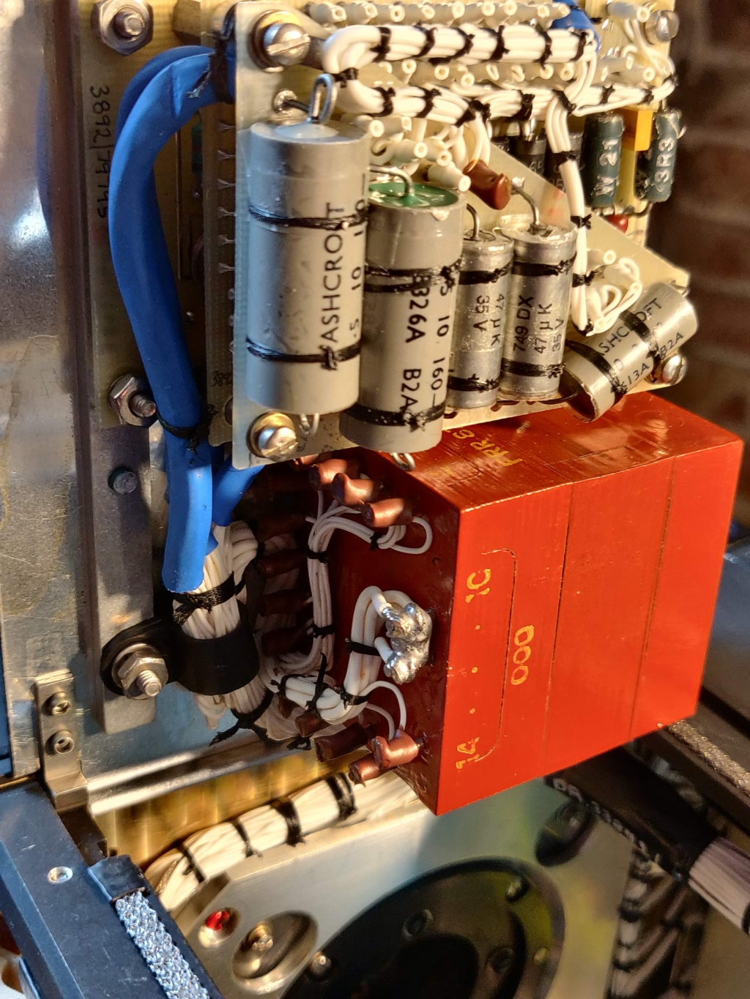
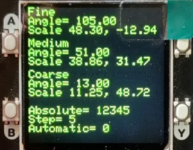
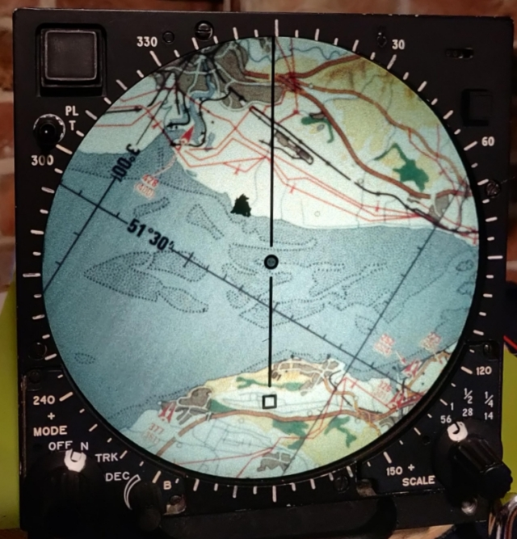
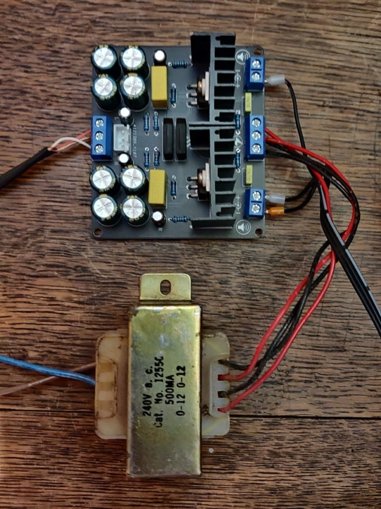
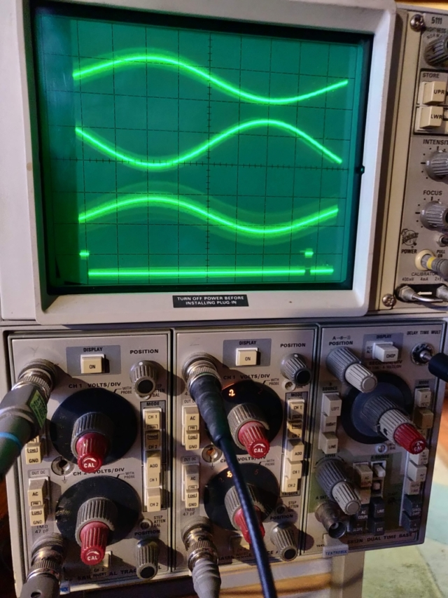
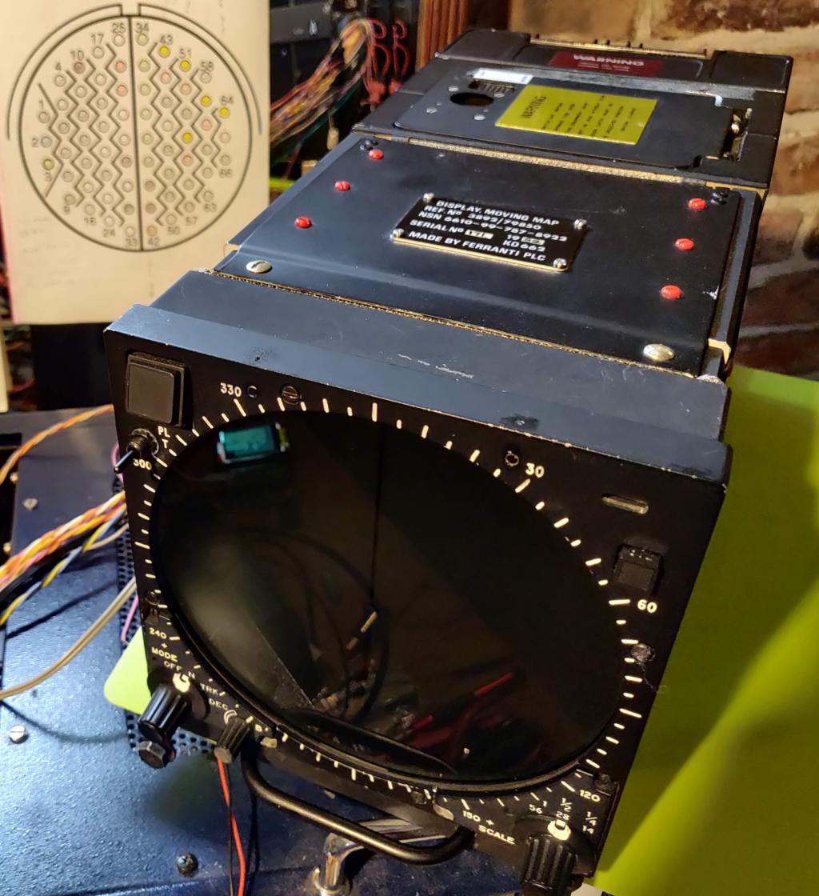

<table><tr>
<tr>
<td valign="bottom">
 
66pin-18B35P-connector.png
</td>

<td valign="bottom">
 
8channelPWMwithSync.jpg
</td>

<td valign="bottom">
 
Amplifier-ERROR-X.png
</td>

<td valign="bottom">
 
IMG_20230517_101057.jpg
</td>

</tr>
<tr>
<td valign="bottom">
 
IMG_20230517_101934.jpg
</td>

<td valign="bottom">
 
IMG_20230517_102222.jpg
</td>

<td valign="bottom">
 
IMG_20230517_103042.jpg
</td>

<td valign="bottom">
 
IMG_20230517_103052.jpg
</td>

</tr>
<tr>
<td valign="bottom">
 
IMG_20230517_103124.jpg
</td>

<td valign="bottom">
 
IMG_20230517_103225.jpg
</td>

<td valign="bottom">
 
IMG_20230517_110333.jpg
</td>

<td valign="bottom">
 
IMG_20230517_113058.jpg
</td>

</tr>
<tr>
<td valign="bottom">
 
IMG_20230517_113410.jpg
</td>

<td valign="bottom">
 
IMG_20230517_134919.jpg
</td>

<td valign="bottom">
 
IMG_20230517_134925.jpg
</td>

<td valign="bottom">
 
IMG_20230517_142305.jpg
</td>

</tr>
<tr>
<td valign="bottom">
 
IMG_20230517_142323.jpg
</td>

<td valign="bottom">
 
IMG_20230517_142336.jpg
</td>

<td valign="bottom">
 
IMG_20230517_214738.jpg
</td>

<td valign="bottom">
 
IMG_20230518_084245.jpg
</td>

</tr>
<tr>
<td valign="bottom">
 
IMG_20230518_084257.jpg
</td>

<td valign="bottom">
 
IMG_20230518_084312.jpg
</td>

<td valign="bottom">
 
IMG_20230518_084331.jpg
</td>

<td valign="bottom">
 
IMG_20230518_084442.jpg
</td>

</tr>
<tr>
<td valign="bottom">
 
LCD-Menu.png
</td>

<td valign="bottom">
 
LCD_status.jpg
</td>

<td valign="bottom">
 
LCD_status2.jpg
</td>

<td valign="bottom">
 
Map-Ryedale.jpg
</td>

</tr>
<tr>
<td valign="bottom">
 
Map_Newport.jpg
</td>

<td valign="bottom">
 
Output-filter-12-channel-PWM.jpg
</td>

<td valign="bottom">
 
ProjectLogo.jpg
</td>

<td valign="bottom">
 
QA_1003_Byers_zero-crossing-rev.jpg
</td>

</tr>
<tr>
<td valign="bottom">
 
RC-Filter.png
</td>

<td valign="bottom">
 
amplifier-gain-adjusted.jpg
</td>

<td valign="bottom">
 
amplifier-resistor-change.jpg
</td>

<td valign="bottom">
 
amplifier.jpg
</td>

</tr>
<tr>
<td valign="bottom">
 
breadboard.jpg
</td>

<td valign="bottom">
 
breadboard2.jpg
</td>

<td valign="bottom">
 
circuit-for-mains-synchronization-has-two-separate-outputs-for-each-half-period.jpg
</td>

<td valign="bottom">
 
connector.jpg
</td>

</tr>
<tr>
<td valign="bottom">
 
improved-opto-detector.png
</td>

<td valign="bottom">
 
media-1180431-a-circuit-for-mains-synchronization-has-two-separate-outputs-for-each-half-period-fig-1.jpg
</td>

<td valign="bottom">
 
opto-detector.png
</td>

<td valign="bottom">
 
oscilloscope.jpg
</td>

</tr>
<tr>
<td valign="bottom">
 
overview.jpg
</td>

<td valign="bottom">
 
testbech-setup.png
</td>

<td valign="bottom">
 
zero-crossing-schematic.jpg
</td>

<td valign="bottom">
 
zero-crossing.jpg
</td>

</tr>
<tr>
<td valign="bottom">
 
zero-crossing.png
</td>

</tr></table>